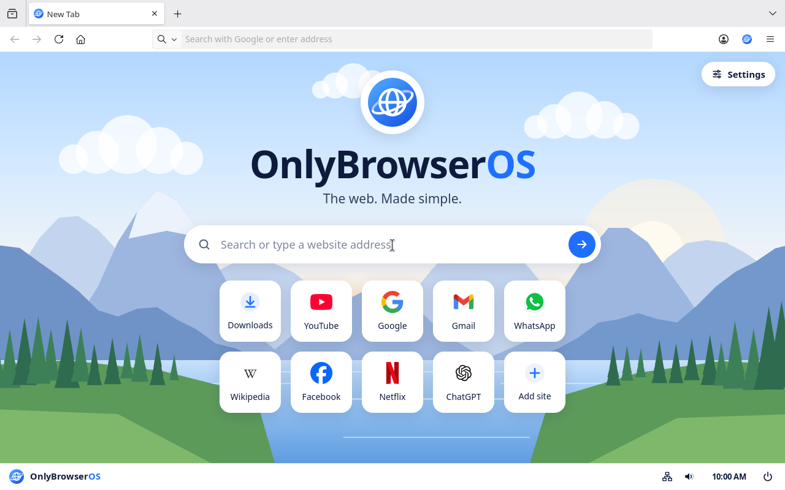
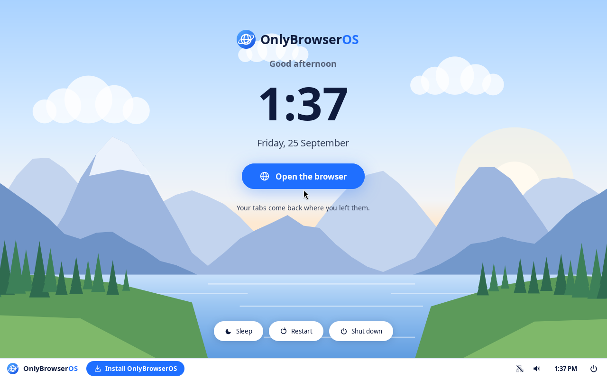

# OnlyBrowserOS

**The web. Made simple.**

OnlyBrowserOS is an operating system I built for old and low-spec laptops.
Turn the computer on and it opens straight into a full-screen browser, with a
small taskbar for Wi-Fi, sound, battery and power. There is no desktop, no file
manager and no app store: nothing to learn and nothing to break.

It runs on laptops with **1 GB of RAM** and a 64-bit processor, starts from a
USB stick, and installs to the disk in four short screens.



## Why I made it

Millions of working laptops sit in drawers because Windows got too heavy for
them, while most people only use a computer for the web: email, YouTube, video
calls, WhatsApp, online forms. Regular Linux brings back a full desktop with a
file manager, a terminal and settings nobody understands. I wanted a computer
my non-technical relatives could use without asking me anything: power on,
browse, power off.

## What it does

- **Boots into the browser** (Firefox ESR, locked down). No login screen and no
  desktop; one browser window fills the screen above a 44 px taskbar.
- **Start page** with a search box that also takes addresses, big tiles for
  popular sites (Downloads, YouTube, Gmail, WhatsApp, …) and "Add site".
- **Taskbar**: Wi-Fi and network cable, Bluetooth (headphones, speakers, mice,
  keyboards), sound and microphone, brightness, battery, clock, memory, power.
- **One Settings page inside the browser**: how powerful the computer is, text
  size, time zone, keyboard, password, history, saved passwords.
- **Made for 1 GB laptops**: Firefox is re-tuned for the machine's memory at
  every boot, compressed swap in RAM (zram), a watchdog that closes the heaviest
  tab before the computer freezes, and a tab limit chosen as "Low-end /
  Mid-range / High-end PC".
- **Can't be broken by accident**: no add-ons, no private windows, no developer
  tools, no terminal, no file system; downloads limited to files the browser can
  open (PDF, pictures, video, music, text).
- **Laptop features**: battery warnings with a safe-shutdown countdown, volume
  and brightness keys with an on-screen level, sleep on lid close or a short
  press of the power button, screen off when idle (but never during a video),
  TVs and projectors mirror the screen automatically.
- **Printing** to Wi-Fi and USB printers with no drivers or setup.
- **Secure Boot can stay on**, so it starts on shop-bought laptops without
  changing firmware settings.
- **Recovers by itself**: a crashed browser, taskbar or screen session restarts;
  closing the browser shows a home screen with an "Open the browser" button.
- **Updates**: Debian security fixes (Firefox included) install automatically.



## Download and install

1. Download `onlybrowseros-<version>-amd64.iso` from the
   [Releases page](https://github.com/AnIntellectualBeing/onlybrowseros/releases)
   and check it against the `.sha256` file next to it.
2. Write it to a USB stick (4 GB or more; everything on it is erased):
   - **Windows:** [Rufus](https://rufus.ie) (choose *DD image mode*) or
     [balenaEtcher](https://etcher.balena.io)
   - **Linux:** `sudo dd if=onlybrowseros-1.2-amd64.iso of=/dev/sdX bs=4M status=progress oflag=sync`
     (replace `sdX` with the stick; check with `lsblk` first)
3. Start the laptop from the stick (usually F12, F9, F2 or Esc at power-on).
4. Try it. When you are happy, click **Install OnlyBrowserOS** on the taskbar.
   Installing **erases the whole disk you choose**.

## Build it yourself

Nothing is compiled: the build downloads ready-made Debian packages, adds
OnlyBrowserOS on top and packs everything into one bootable ISO. You need a
Debian or Ubuntu machine (a virtual machine is fine) with 12 GB free disk and
an internet connection.

```sh
git clone https://github.com/AnIntellectualBeing/onlybrowseros.git
cd onlybrowseros/github/build
sudo ./build-iso.sh                 # 30-60 min the first time
./test-iso.sh --auto-live --ram 1024   # optional: boot it in QEMU and test it
```

The ISO lands in `github/build/out/`. After changing anything in `github/src/`,
`sudo ./build-iso.sh --from overlay` rebuilds in a few minutes.

**[docs/06-build-from-scratch.md](docs/06-build-from-scratch.md)** walks
through the whole process by hand, one command at a time, explaining what each
step does and why, so you can make a system like this without my scripts.

## Documentation

| | |
|---|---|
| [01 – What it is](docs/01-what-it-is.md) | The product, who it is for |
| [02 – How it works](docs/02-how-it-works.md) | Architecture from power-on to browser |
| [03 – The build system](docs/03-how-it-was-built.md) | How the scripts assemble, test and publish the ISO |
| [04 – Decisions and why](docs/04-decisions-and-why.md) | Every important trade-off |
| [05 – What's left](docs/05-whats-left.md) | Known gaps and the to-do list |
| [06 – Build it from scratch](docs/06-build-from-scratch.md) | The full process by hand, step by step |
| [07 – How I built it](docs/07-project-story.md) | The project from first prototype to v1.2, and the hard problems |
| [08 – Memory](docs/08-memory.md) | Where the RAM goes and how I brought it down |

## Project layout

```
docs/                  documentation (start here)
github/src/            everything OnlyBrowserOS adds to Debian
  panel/               the taskbar (Python + GTK 3)
  installer/           the installer and its root helper
  home/                the "browser was closed" screen
  firefox/             Firefox lock-down, and the OnlyBrowserOS extension
  start/               the start page and the Downloads page
  session/             boot-to-browser scripts
  system/              root helpers: memory tuning, settings, USB, self-test
  shared/              colours, logo, the landscape drawing, tab levels
github/build/          build, test and release scripts
  config.sh            every package and setting of the image
  overlay/             system configuration files copied into the image
github/legacy/         my first prototype (a desktop made of web pages), kept for reference
```

## Status

Version 1.2. Tested automatically in QEMU on BIOS, UEFI and UEFI with Secure
Boot, with 1 to 2 GB of RAM. Real-hardware testing is in progress; see
[docs/05-whats-left.md](docs/05-whats-left.md).

Based on Debian 13 "trixie". OnlyBrowserOS's own code is by AnIntellectualBeing;
Debian, Firefox and the other packages keep their own licences.
