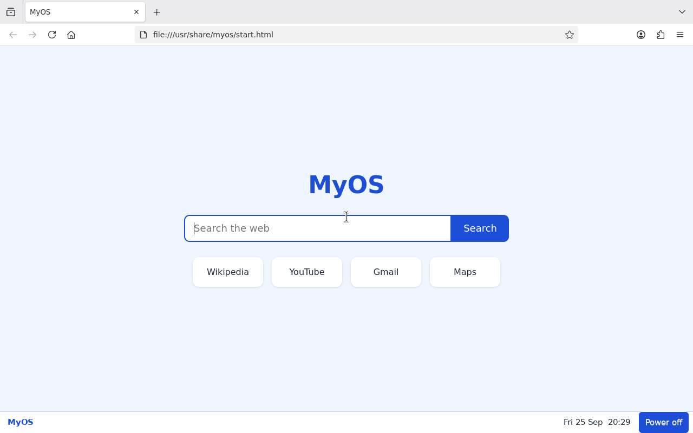

# Make Your Own Operating System — a Hands-on Course

This course starts from an empty folder and ends with **MyOS**: an operating
system that starts from a USB stick, logs in by itself and opens a browser full
screen above a bar you wrote yourself. Along the way you learn what every
piece of an operating system does and how to change each one.



*The finished MyOS after Lesson 9, booted in QEMU: logged in by itself, Firefox
with the MyOS start page, and the bar from Lesson 7.*

It's the same method I used for OnlyBrowserOS, cut down to what you need to
understand it. Each lesson ends by showing where OnlyBrowserOS does the same
thing for real.

**How to use it**

- The ready-made example is in [`docs/myos/`](myos/):
  - `build.sh`: every lesson as a function
  - `grub.cfg`: the boot menu
  - `packages/`: your own customisations as two Debian packages
  - `test.sh`: start the result in a virtual PC
- Every lesson shows the commands, explains what they did, and tells you
  how to check the result.
- You can stop after any lesson and boot the result:
  `sudo ./build.sh --to 4 && ./test.sh`.
- Read the commands before you run the script. Typing them yourself inside a
  chroot (Lesson 1) is even better; that's how you really learn it.

```
Lesson 0   The build machine                  what you install once
Lesson 1   A minimal Debian in a folder       debootstrap, chroot
Lesson 2   Make it bootable → your first ISO  kernel, initramfs, live-boot, GRUB, squashfs
Lesson 3   Give it a name                     os-release, hostname, login text, boot menu
Lesson 4   Log in by itself + your service    systemd units, drop-ins, targets
Lesson 5   Networking                         NetworkManager
Lesson 6   Graphics and a kiosk browser       X server, startx, openbox, Firefox
Lesson 7   Your own desktop, as a package     .deb packages, a session, a GTK bar
Lesson 8   Your own browser set-up            Firefox policies, a start page
Lesson 9   Real laptops                       firmware, drivers, sound, USB stick
Lesson 10  When something goes wrong          where to look at every stage
Lesson 11  Where to go next                   installer, Secure Boot, updates, memory
Cookbook   Quick customisation recipes
```

---

# Part A — What you need to understand first

## A1. What happens when you press the power button

```
 firmware (BIOS or UEFI)          built into the computer
   │  finds a boot loader on the disk / USB stick
   ▼
 boot loader (GRUB)               shows the menu, loads two files into memory:
   │                              the kernel and the initramfs
   ▼
 kernel (Linux)                   drives the hardware; starts the initramfs
   │
   ▼
 initramfs                        a tiny temporary system in RAM; its one job:
   │                              find the real system and switch to it
   ▼
 init = systemd (process 1)       starts every service in the right order
   │
   ├── udev, NetworkManager, sound, …          (services)
   └── getty on tty1 → login → your shell → startx → window manager → your programs
```

An operating system is really just this chain. The firmware, kernel, init
and every service already exist as free software. **Making an OS means
choosing the pieces, configuring how they connect, and adding your own
layer on top.** Almost nothing has to be compiled.

## A2. The file system map

Every Linux system has the same folders. Knowing them tells you where to put
things:

| Folder | What lives there | You will… |
|---|---|---|
| `/usr/bin`, `/usr/lib` | Programs and libraries (from packages) | put your own programs in `/usr/bin` and `/usr/lib/<yourname>/` |
| `/usr/share` | Data files: icons, pages, defaults | put your start page and configs in `/usr/share/<yourname>/` |
| `/etc` | System-wide **settings** | change hostname, services, login rules |
| `/etc/skel` | Template copied into every new user's home | put default user settings here |
| `/home/<user>` | A user's own files and settings | |
| `/var` | Changing data: logs, caches, package lists | |
| `/boot` | Kernel and initramfs | |
| `/proc`, `/sys`, `/dev`, `/run` | **Not real files**: live views into the kernel, filled in at run time | mount them before using a chroot |
| `/usr/local` | Things installed by hand, not by packages | quick experiments (Lesson 4) |

The rule of thumb: **programs under `/usr`, settings under `/etc`, changing data under `/var`.**

## A3. A distribution is a kernel plus packages plus choices

Debian has about 60,000 **packages**. A package (`.deb`) is an archive with:
- the files, laid out as they go on the system (`usr/bin/…`, `etc/…`)
- a `control` file: its name, version, and which other packages it
  **Depends** on (must have) or **Recommends** (usually wanted)
- optional scripts that run after install/removal (`postinst`, `prerm`, …)

`dpkg` installs one `.deb` file. `apt` downloads packages and works out
dependencies. Every file on the system belongs to exactly one package
(`dpkg -S /usr/bin/firefox-esr` tells you which), which is how updates and
removals stay clean. This is why your own customisations should also be a
package (Lesson 7).

## A4. systemd in five minutes

systemd is process 1. It reads **unit files**:
- `something.service`: a program to run (and restart, log, order)
- `something.target`: a group of units, a "stage" of starting up
  (`multi-user.target` = everything up, no graphical login screen)
- `something.timer`, `.socket`, `.mount`: start things at a time, on a
  connection, or mount a disk

Packages put units in `/usr/lib/systemd/system/`, and you put yours in
`/etc/systemd/system/`. `systemctl enable x.service` doesn't start anything.
It creates a symlink in `…/multi-user.target.wants/`, which means "when
multi-user.target starts, start x too". A **drop-in**
(`x.service.d/something.conf`) changes a few lines of a unit without copying
it; Lesson 4 uses one. `journalctl` shows everything every service printed.

## A5. How a "live" USB stick works

The whole system is packed into one compressed, read-only file,
`filesystem.squashfs`. At start-up, the initramfs (with the `live-boot`
package inside it) finds the stick, mounts that file, and puts a writable
layer **in RAM** on top of it (overlayfs). Programs can write anywhere, but
the changes live in RAM and are gone after a restart. That's why a live
system can't be broken, and why installing is just "copy this system onto a
disk".

## A6. How a picture gets on the screen

```
kernel graphics driver (i915, amdgpu, bochs in a VM…)
  → X server (Xorg): owns the screen, keyboard and mouse
    → window manager (openbox): decides where windows go and what frames they get
      → your programs (Firefox, your bar), which draw inside their windows
```

I use X and openbox because they're small, well understood and work on every
old laptop. Wayland (the newer design, where the window manager and the
display server are one program, like `cage` or `sway`) is the alternative.
The same ideas apply there.

## A7. chroot: stepping inside the system you're building

`chroot <folder> <program>` runs a program with `<folder>` as its `/`. Inside,
`apt-get install` installs into *your* system, not the build machine's. The
kernel is still the build machine's, so the running-system folders (`/proc`,
`/sys`, `/dev`, `/run`) have to be mounted in first. It's like working inside
the new OS without booting it.

---

# Part B — The lessons

Commands with `$` run as your normal user, and `#` as root (`sudo -i`).
`(chroot)#` means inside the chroot.

## Lesson 0 — The build machine

Use a Debian or Ubuntu computer, or better, a **virtual machine** (VirtualBox
with Ubuntu 24.04 is what I used: 4+ cores, 8 GB RAM, 50 GB disk). The build
runs as root, and a VM means a mistake can't hurt your real system.

```
$ sudo apt install debootstrap squashfs-tools xorriso mtools dosfstools \
      grub-pc-bin grub-efi-amd64-bin grub-common dpkg-dev \
      debian-archive-keyring qemu-system-x86 qemu-utils ovmf
$ cd ~/Documents/projects/webos/docs/myos        # or copy this folder anywhere
```

| Tool | Used for |
|---|---|
| `debootstrap` | downloads a minimal Debian into a folder |
| `squashfs-tools` | `mksquashfs`: packs that folder into one compressed file |
| `grub-*`, `xorriso`, `mtools` | `grub-mkrescue`: makes a bootable ISO (BIOS + UEFI) |
| `dpkg-dev` | `dpkg-deb`: builds your own packages |
| `qemu-system-x86`, `ovmf` | a virtual PC to test in (OVMF = UEFI firmware for it) |

---

## Lesson 1 — A minimal Debian in a folder

```
# mkdir -p work
# debootstrap --variant=minbase \
      --components=main,contrib,non-free,non-free-firmware \
      --include=ca-certificates \
      trixie work/chroot http://deb.debian.org/debian
```

**What happened:** debootstrap downloaded Debian 13 ("trixie")'s essential
packages and unpacked them into `work/chroot`. It's a complete Debian: shell,
`apt`, `/etc`, `/usr`. But it has no kernel, no init system and no network
manager, so it can't start on its own yet.

- `--variant=minbase`: only the "Essential" packages plus apt, the smallest
  start possible.
- `non-free-firmware`: needed later, because most Wi-Fi cards need
  manufacturer firmware.
- On Ubuntu, if debootstrap says it doesn't know `trixie`:
  `# ln -s sid /usr/share/debootstrap/scripts/trixie`.

**Look inside it.** Enter the chroot by hand once. The same mounts are done by
`enter()` in `build.sh`:

```
# C=work/chroot
# mount -t proc proc $C/proc;  mount -t sysfs sys $C/sys
# mount --bind /dev $C/dev;    mount -t devpts devpts $C/dev/pts
# mount -t tmpfs tmpfs $C/run
# cp -L /etc/resolv.conf $C/etc/resolv.conf     # so apt can look up names
# chroot $C /bin/bash
(chroot)# cat /etc/debian_version
(chroot)# ls /usr/bin | wc -l
(chroot)# dpkg -l | wc -l            # how many packages
(chroot)# exit
# umount $C/run $C/dev/pts $C/dev $C/sys $C/proc
```

`build.sh` step: `sudo ./build.sh --to 1`, then `du -sh work/chroot`
(about 220 MB).

---

## Lesson 2 — Make it bootable: your first ISO

A system can start only if it has:
1. a **kernel**
2. an **init** (systemd)
3. an **initramfs** that knows how to find the system (on a USB stick,
   that's `live-boot`)
4. a **boot loader** and a boot medium: the ISO

### 2a. Package sources, and keeping it small

```
(chroot)# cat > /etc/apt/sources.list <<'EOF'
deb http://deb.debian.org/debian trixie main contrib non-free non-free-firmware
deb http://deb.debian.org/debian trixie-updates main contrib non-free non-free-firmware
deb http://security.debian.org/debian-security trixie-security main contrib non-free non-free-firmware
EOF
(chroot)# cat > /etc/apt/apt.conf.d/99myos <<'EOF'
APT::Install-Recommends "false";
APT::Install-Suggests "false";
EOF
```

Turning off **Recommends** is the biggest single size and memory saving:
Debian packages "recommend" lots of extras. The price is that you must name
every package you really need. Forgetting one is a real class of bug: in
OnlyBrowserOS, Bluetooth headphones paired but stayed silent because
PipeWire's Bluetooth module is only a *recommendation*.

Before installing anything inside, stop packages from starting services
on the build machine:

```
# printf '#!/bin/sh\nexit 101\n' > $C/usr/sbin/policy-rc.d && chmod +x $C/usr/sbin/policy-rc.d
```

### 2b. Kernel, init, live-boot, a user

```
(chroot)# apt-get update
(chroot)# apt-get install -y linux-image-amd64 systemd-sysv udev dbus libpam-systemd \
             live-boot live-boot-initramfs-tools initramfs-tools sudo procps less nano
(chroot)# useradd --create-home --shell /bin/bash --groups sudo,audio,video,render,input me
(chroot)# echo 'me:live' | chpasswd
(chroot)# passwd -l root                  # no root password; "me" uses sudo
(chroot)# update-initramfs -u -k all      # put live-boot into the initramfs
```

| Package | Why |
|---|---|
| `linux-image-amd64` | the kernel (`/boot/vmlinuz-*`) and its drivers (`/usr/lib/modules`) |
| `systemd-sysv` | makes systemd the init (`/sbin/init`) |
| `udev` | notices hardware and loads drivers for it |
| `dbus`, `libpam-systemd` | how programs talk to each other; gives a logged-in user a "session", which is what later lets them use the screen and switch off the computer |
| `live-boot*`, `initramfs-tools` | build the initramfs, and teach it to boot from a squashfs file |

The groups: `sudo` = may become root, `video`/`render` = may use the
graphics card, `audio` = sound, `input` = keyboard and mouse.

### 2c. The boot menu

`grub.cfg` (the whole file is in `docs/myos/grub.cfg`):

```
set timeout=5
menuentry "Start MyOS" {
    linux  /live/vmlinuz boot=live quiet
    initrd /live/initrd.img
}
```

- `linux` loads the kernel; everything after it is the **kernel command line**.
- `boot=live` switches live-boot on in the initramfs.
- `quiet` hides the start-up messages.
- `initrd` loads the initramfs.
- Other entries add `nomodeset` (basic graphics for awkward screens) or
  `console=ttyS0` (messages to a serial port, for debugging).

### 2d. Pack it into an ISO

This is `make_iso()` in `build.sh`:

```
# rm -f $C/usr/sbin/policy-rc.d $C/etc/resolv.conf     # build-time only
# umount $C/run $C/dev/pts $C/dev $C/sys $C/proc
# rm -rf $C/var/lib/apt/lists/* $C/tmp/*
# : > $C/etc/machine-id            # empty = each computer makes its own ID at first start

# mkdir -p work/iso/live work/iso/boot/grub
# cp $C/boot/vmlinuz-*    work/iso/live/vmlinuz
# cp $C/boot/initrd.img-* work/iso/live/initrd.img
# cp grub.cfg work/iso/boot/grub/grub.cfg
# mksquashfs $C work/iso/live/filesystem.squashfs -comp zstd -noappend
# grub-mkrescue -o out/myos.iso work/iso -- -volid MYOS
```

The ISO contains exactly four things:

```
myos.iso
├── boot/grub/grub.cfg          the menu              (+ GRUB itself, added by grub-mkrescue)
├── live/vmlinuz                the kernel
├── live/initrd.img             the initramfs
└── live/filesystem.squashfs    the entire system, compressed
```

- `mksquashfs … -comp zstd`: zstd decompresses very fast, which matters
  more on an old laptop than a slightly smaller file (xz).
- `grub-mkrescue` adds GRUB for **both** BIOS and UEFI computers and makes a
  "hybrid" image that works burned to a DVD or written to a USB stick.
- What `grub-mkrescue` can't do is **Secure Boot**: its GRUB isn't signed
  by Microsoft. Most laptops sold since 2012 have Secure Boot on. For this
  course, switch it off in the laptop's firmware settings. Lesson 11 shows
  how OnlyBrowserOS gets past it without that.

### Check it

```
$ sudo ./build.sh --to 2
$ ./test.sh              # a window with the boot menu, then a login prompt
```

The ISO after Lesson 2 is about 400 MB, almost all of it the kernel's
drivers. Log in as `me` / `live`. You're in your own operating system: try `free -m`,
`systemctl status`, `ls /`, `cat /proc/cmdline`, then `sudo poweroff`.

`./test.sh --serial` shows the same thing inside your terminal instead of a
window (quit with Ctrl+A, then X).

---

## Lesson 3 — Give it a name

What makes a system *yours* is mostly a handful of small text files:

```
(chroot)# cat > /usr/lib/os-release <<'EOF'
PRETTY_NAME="MyOS 0.1"
NAME="MyOS"
VERSION_ID="0.1"
ID=myos
ID_LIKE=debian
EOF
(chroot)# echo myos > /etc/hostname
(chroot)# printf '127.0.0.1\tlocalhost\n127.0.1.1\tmyos\n' > /etc/hosts
(chroot)# printf 'MyOS 0.1 \\n \\l\n\n' > /etc/issue
(chroot)# printf '\nWelcome to MyOS.\n\n' > /etc/motd
```

| File | Who reads it |
|---|---|
| `/usr/lib/os-release` (`/etc/os-release` links to it) | Every program that asks "which OS is this?": systemd's boot message "Welcome to MyOS 0.1!", `hostnamectl`, installers, websites' OS detection via the browser |
| `/etc/hostname` | the computer's network name (the prompt shows `me@myos`) |
| `/etc/issue` | text above the login prompt; `\n` = host name, `\l` = terminal |
| `/etc/motd` | "message of the day" after logging in |
| `grub.cfg` | the boot menu: entry names, colours (`menu_color_normal=white/blue`), timeout |

`os-release` belongs to Debian's `base-files` package, so a `base-files`
update would put Debian's text back. OnlyBrowserOS writes it at build time and
again from its own package, so it always wins.

**Check:** boot. systemd greets you with "Welcome to **MyOS 0.1**!", and the
login prompt says `MyOS 0.1 myos tty1`.

---

## Lesson 4 — Log in by itself, and your first service

### Automatic login: a drop-in

The login prompt on the first screen comes from `getty@tty1.service`. To log
`me` in automatically, override only its start command:

```
(chroot)# mkdir -p /etc/systemd/system/getty@tty1.service.d
(chroot)# cat > /etc/systemd/system/getty@tty1.service.d/autologin.conf <<'EOF'
[Service]
ExecStart=
ExecStart=-/sbin/agetty --noclear --autologin me %I $TERM
EOF
```

The empty `ExecStart=` first clears the original command, and the second line
sets the new one. The same pattern changes any setting of any service.

### Your own program, started by systemd

```
(chroot)# cat > /usr/local/bin/myos-hello <<'EOF'
#!/bin/sh
ram=$(free -m | awk '/^Mem:/ {print $2}')
echo "MyOS: started with $(nproc) CPU(s) and $ram MB of RAM"
EOF
(chroot)# chmod +x /usr/local/bin/myos-hello
(chroot)# cat > /etc/systemd/system/myos-hello.service <<'EOF'
[Unit]
Description=Say hello at start-up

[Service]
Type=oneshot
ExecStart=/usr/local/bin/myos-hello
StandardOutput=journal+console

[Install]
WantedBy=multi-user.target
EOF
(chroot)# systemctl enable myos-hello.service
```

- `Type=oneshot`: runs once and finishes (a server would be `Type=simple`
  with `Restart=on-failure`).
- `StandardOutput=journal+console`: its output goes to the log *and* the screen.
- `[Install] WantedBy=multi-user.target` + `enable`: start it at every boot.

**Check:** boot. `me` is logged in without a prompt. Run
`journalctl -u myos-hello`, and `systemd-analyze blame` to see how long every
service took to start.

Everything OnlyBrowserOS does at boot, like tuning Firefox to the amount of
RAM, is a service like this one (`onlybrowseros-tune.service`).

---

## Lesson 5 — Networking

```
(chroot)# apt-get install -y network-manager wpasupplicant iw rfkill wireless-regdb iputils-ping curl
(chroot)# systemctl enable NetworkManager
(chroot)# systemctl disable NetworkManager-wait-online   # don't hold up start-up waiting for Wi-Fi
```

- **NetworkManager** handles cables and Wi-Fi automatically.
- `wpasupplicant` does Wi-Fi passwords.
- `wireless-regdb` holds the legal radio rules for each country.
- In the ISO, `/etc/resolv.conf` becomes a link to the file NetworkManager
  writes (`/run/NetworkManager/resolv.conf`). During the build, it's a copy of
  the build machine's.

**Check:** boot, then `nmcli device`, `ping -c3 debian.org` and
`curl -I https://example.org`. On a real laptop:
`nmcli device wifi list` and `nmcli device wifi connect "Name" password "…"`.
OnlyBrowserOS's taskbar is a friendly front-end to exactly these `nmcli`
commands.

---

## Lesson 6 — Graphics, and a browser that fills the screen

```
(chroot)# apt-get install -y xserver-xorg-core xserver-xorg-input-libinput xinit \
             x11-xserver-utils openbox firefox-esr fonts-dejavu-core fonts-noto-color-emoji
```

| Package | Role |
|---|---|
| `xserver-xorg-core` | the X server; includes the `modesetting` driver, which works on most graphics cards and in VMs |
| `xserver-xorg-input-libinput` | keyboard, mouse, touchpad |
| `xinit` | `startx`: starts X and then your programs |
| `openbox` | a tiny window manager (a few MB of RAM) |
| `firefox-esr` | Firefox "Extended Support Release": one version for a year, security fixes weekly |
| fonts | without them, pages show boxes instead of letters and emoji |

There's **no login screen** (display manager). The auto-login from Lesson 4
already gives us a logged-in user on tty1, so their shell starts the
graphics. `~/.bash_profile` runs at every login:

```
[ -f ~/.bashrc ] && . ~/.bashrc
if [ -z "$DISPLAY" ] && [ "$(tty)" = /dev/tty1 ]; then
    exec startx -- vt1 -keeptty >~/.xorg.log 2>&1
fi
```

"If there's no screen yet and this is the first console, start X." The
other consoles (Ctrl+Alt+F2) stay plain text logins, which is your way in
when the graphics don't work. `startx` runs `~/.xinitrc`:

```
xset s off -dpms                                     # never blank the screen
openbox &                                            # window manager in the background
exec firefox-esr --kiosk https://www.wikipedia.org   # the browser, full screen
```

Both files go into `/etc/skel` (template for new users) and into `me`'s home.

Why does X start as a normal user, without root? The auto-login created a
proper **session** (thanks to `libpam-systemd` from Lesson 2), and logind
gives the user of the active session access to the screen and input
devices. That's why those packages had to be there.

**Check:** boot. After a few seconds, Wikipedia fills the whole screen. That's
the core of a kiosk system. With `--kiosk` there is no address bar at all.

---

## Lesson 7 — Your own desktop, as a package

A kiosk browser alone has no clock, no way to switch off and no second
window. Now we add **our own layer**:
- a **session script** that starts everything
- a **bar** at the bottom (Python + GTK)
- **window rules** for openbox

All of it is packed into our own `.deb` package.

### Why a package and not just copied files?

- `dpkg -L myos-desktop` lists every file you added, and
  `dpkg -S /usr/lib/myos/bar.py` tells you who owns a file.
- **Depends:** installing it pulls in everything it needs.
- The same file can later be published as an **update** that computers
  install by themselves (Lesson 11). The ISO build and the updates then
  install exactly the same thing.
- Removing it removes all of it.

### The package folder

```
packages/myos-desktop/
├── DEBIAN/control                  name, version, dependencies
├── usr/bin/myos-session            the session: what runs on the screen
├── usr/lib/myos/bar.py             the bar
└── usr/share/myos/openbox.xml      window rules
```

`DEBIAN/control`:

```
Package: myos-desktop
Version: 0.1
Architecture: all
Maintainer: Your Name <you@example.org>
Depends: xserver-xorg-core, xinit, x11-xserver-utils, openbox, firefox-esr,
 python3, python3-gi, gir1.2-gtk-3.0, polkitd
Description: MyOS desktop: session, bar and window rules
 Starts the browser full screen above a small bar that shows the time
 and has a power button.
```

- `Architecture: all`: scripts only, so it runs on any CPU.
- `polkitd` lets logind decide that the person at the computer may switch it
  off (the power button).
- `python3-gi` + `gir1.2-gtk-3.0` = GTK for Python.

Build and install it:

```
$ dpkg-deb --root-owner-group --build packages/myos-desktop myos-desktop.deb
# cp myos-desktop.deb $C/tmp/
(chroot)# apt-get install -y /tmp/myos-desktop.deb     # apt, not dpkg: it installs the Depends too
(chroot)# dpkg -L myos-desktop
```

`--root-owner-group` makes every file owned by root inside the package,
whoever built it.

### The session: `usr/bin/myos-session`

```sh
#!/bin/sh
xset s off -dpms
xsetroot -solid '#dbeafe'                                 # background colour
openbox --config-file /usr/share/myos/openbox.xml &       # window manager with OUR rules
python3 /usr/lib/myos/bar.py &                            # our bar
while true; do                                            # the browser, re-opened if closed
    firefox-esr
    sleep 1
done
```

`.bash_profile` now runs `startx /usr/bin/myos-session` instead of
`~/.xinitrc`. The session ends when this script ends. Because of the loop,
closing Firefox just opens it again, and the user can never end up at an
empty screen.

### The window rules: `usr/share/myos/openbox.xml`

```xml
<margins><bottom>40</bottom></margins>          <!-- keep 40 px for the bar -->
<application class="firefox*" type="normal">   <!-- every Firefox window: -->
  <decor>no</decor>                            <!--   no title bar          -->
  <maximized>yes</maximized>                   <!--   fills the screen      -->
</application>
<application name="myos-bar">                  <!-- our bar: always on top -->
  <layer>above</layer>
</application>
```

Windows are recognised by their **class/name**. To find out what a
window is called, run `xprop WM_CLASS` in a terminal and click it (package
`x11-utils`). Keyboard shortcuts go in the same file (`<keybind key="A-F4">`).

### The bar: `usr/lib/myos/bar.py`

~80 lines of Python. The important parts:

```python
self.set_wmclass("myos-bar", "myos-bar")        # the name openbox.xml matches
self.set_type_hint(Gdk.WindowTypeHint.DOCK)     # "I am a panel", not a normal window
area = Gdk.Display.get_default().get_monitor(0).get_geometry()
self.set_size_request(area.width, HEIGHT)       # full width…
self.move(area.x, area.y + area.height - HEIGHT)  # …at the bottom
...
GLib.timeout_add_seconds(5, self.tick)          # update the clock every 5 s
...
subprocess.run(["systemctl", "poweroff"])       # the power button
```

Its colours come from CSS, the same language as web pages. GTK is styled
with CSS, so changing the look means editing the `CSS` block at the top.

**Check:** `sudo ./build.sh --from 7 --to 7`, then `./test.sh`. You see
Firefox above a white bar showing "MyOS", the time and a blue *Power off*
button. Click it and confirm, and the computer switches off.

In OnlyBrowserOS, the same three things are `src/session/onlybrowseros-session`,
`build/overlay/etc/onlybrowseros/openbox/rc.xml` and `src/panel/panel.py`
(which adds Wi-Fi, Bluetooth, sound, battery and brightness menus). All of
it is one package built by `build/make-package.sh`.

---

## Lesson 8 — Your own browser set-up

Firefox reads **enterprise policies** from
`/usr/lib/firefox-esr/distribution/policies.json`. They're the official way
schools and companies lock Firefox down, and they need no add-on. Our second
package, `myos-browser`, ships that file plus a start page:

```
packages/myos-browser/
├── DEBIAN/control                                        Depends: firefox-esr
├── usr/lib/firefox-esr/distribution/policies.json        the rules
└── usr/share/myos/start.html                             the start page
```

`policies.json` (shortened):

```json
{
  "policies": {
    "Homepage": { "URL": "file:///usr/share/myos/start.html", "StartPage": "homepage", "Locked": true },
    "OverrideFirstRunPage": "",
    "DontCheckDefaultBrowser": true,
    "DisableDeveloperTools": true,
    "DisablePrivateBrowsing": true,
    "BlockAboutConfig": true,
    "DisableTelemetry": true,
    "UserMessaging": { "SkipOnboarding": true, "Locked": true }
  }
}
```

- `Homepage` + `StartPage`: open our page when Firefox starts.
- `OverrideFirstRunPage` / `SkipOnboarding`: no "welcome to Firefox" tabs.
- `Disable…` / `Block…`: take away things an ordinary user shouldn't reach.

The full list of policies is at
<https://mozilla.github.io/policy-templates/>. Inside Firefox, `about:policies`
shows which ones are active and flags any typo. It's the first thing to open
when a policy "does nothing".

The start page is plain HTML and CSS, with a search form that sends you to a
search engine and big links to popular sites. Anything you can build as a web
page, you can make the start page of your OS.

**Check:** `sudo ./build.sh --from 8 --to 8 && ./test.sh`. Firefox opens on
the blue MyOS page; the ☰ menu has no "New private window", and F12 does nothing.

OnlyBrowserOS goes one step further: `src/firefox/onlybrowseros.cfg` (Firefox
"autoconfig", a JavaScript file Firefox runs at start) hides menus that
policies can't, and `src/system/tune` rewrites the policies at every boot to
match the computer's RAM.

---

## Lesson 9 — Real laptops

A VM has simple, standard virtual hardware. Real laptops need more:

```
(chroot)# apt-get install -y xserver-xorg-video-all pipewire pipewire-pulse wireplumber systemd-zram-generator
(chroot)# for p in firmware-linux-free firmware-misc-nonfree firmware-iwlwifi firmware-realtek \
             firmware-atheros firmware-intel-graphics firmware-amd-graphics firmware-sof-signed \
             intel-microcode amd64-microcode; do apt-get install -y $p || echo "skipped $p"; done
(chroot)# update-initramfs -u -k all
```

| What | Why |
|---|---|
| **firmware-\*** | Wi-Fi, Bluetooth, graphics and sound chips load a small manufacturer program at start. Without it they simply don't work: "no Wi-Fi" on a real laptop is almost always missing firmware. `dmesg \| grep -i firmware` names what's missing. |
| **microcode** | CPU bug and security fixes, loaded at start |
| `xserver-xorg-video-all` | older graphics cards that `modesetting` doesn't handle |
| **PipeWire** | the sound system (Firefox plays through it) |
| **zram** | compressed swap in RAM: a 1 GB laptop behaves like it has ~1.5 GB |

The ISO grows from about 400 MB to about 1.2 GB here, mostly because of
firmware. OnlyBrowserOS gets the same hardware support into 800 MB with the
"Smaller ISO" recipe in the Cookbook and stronger compression
(`mksquashfs … -comp zstd -Xcompression-level 19`, slower to build).

### Put it on a USB stick

```
$ lsblk                                  # find the stick, e.g. /dev/sdb. CHECK the size!
$ sudo dd if=out/myos.iso of=/dev/sdb bs=4M status=progress oflag=sync
```

`dd` writes the file byte for byte and **erases the whole stick**; a wrong
letter erases a wrong disk. On Windows, use Rufus (DD mode) or balenaEtcher.

On the laptop, switch Secure Boot off (see Lesson 2d), then open the one-time
boot menu (usually F12, F9, F10 or Esc while it starts) and choose the USB
stick.

---

## Lesson 10 — When something goes wrong

Work out *which stage* failed (A1's chain), then look in the right place:

| Symptom | Stage | Where to look / what to try |
|---|---|---|
| Laptop doesn't list the stick | firmware | Stick written with `dd`/Rufus DD mode? UEFI-only laptop with an old BIOS-only image? Secure Boot on? |
| GRUB menu, then a black screen | kernel / graphics | Menu entry "safe graphics" (`nomodeset`); remove `quiet` to read the messages (press `e` in the GRUB menu to edit an entry for one start) |
| Stuck at "(initramfs)" prompt | initramfs | live-boot couldn't find `filesystem.squashfs`: check `ls /live` on the ISO, `boot=live` in grub.cfg, and that `update-initramfs` ran after installing live-boot |
| Text login instead of the browser | graphics session | Ctrl+Alt+F2, log in, `cat ~/.xorg.log`; try `startx` by hand to see the error |
| A service misbehaves | systemd | `systemctl --failed`, `systemctl status x`, `journalctl -b -u x`, `journalctl -b -p err` |
| "No Wi-Fi" / no sound on real hardware | drivers | `dmesg \| grep -iE 'firmware\|error'`, `lspci -k` (which driver each device uses) |
| Firefox ignores a setting | browser | `about:policies`, `about:support` |

Tricks I used all the time:
- **Serial console**: `./test.sh --serial` prints every boot message into your
  terminal, and they can be saved to a file. `build/test-iso.sh` in
  OnlyBrowserOS runs whole test rounds this way, with no window.
- **Stop inside the initramfs**: add `break=premount` to the kernel command
  line (press `e` in GRUB) to get a shell *before* the system is mounted.
- **Fix without booting**: `chroot work/chroot` and look at or change files,
  then just re-run `sudo ./build.sh --iso`.
- **Rebuild only what changed**: `--from N` redoes lessons N and later on the
  existing system instead of downloading everything again.
- **Keep logs of every build**: `sudo ./build.sh 2>&1 | tee build-3.log`, so
  you can compare with the last one that worked.

---

## Lesson 11 — Where to go next

MyOS is the skeleton. OnlyBrowserOS is the same skeleton plus these, and each
one is documented:

| Next step | How OnlyBrowserOS does it | Read |
|---|---|---|
| **Secure Boot** without switching it off | the ISO boots Microsoft-signed `shim` → Debian-signed GRUB → Debian-signed kernel, assembled by hand instead of `grub-mkrescue` | [`06` Part 9](06-build-from-scratch.md#part-9--the-boot-loader-and-the-iso-bios--uefi--secure-boot) |
| **An installer** | partition the disk, `rsync` the live system onto it, rename the user, remove live-boot, `grub-install` | [`06` Part 12](06-build-from-scratch.md#part-12--how-the-installer-turns-the-live-system-into-an-installed-one) |
| **Updates** | Debian's security updates via `unattended-upgrades`; your own package in a GPG-signed apt repository on GitHub Pages | [`03`](03-how-it-was-built.md), [`09`](09-how-i-work.md) |
| **1 GB of RAM** | zram, earlyoom, Firefox tuned per machine, a tab limit | [`08-memory.md`](08-memory.md) |
| **Automated tests** | kernel flag `obos.autotest=report` makes a script inside the image test everything and report over the serial port | [`03`](03-how-it-was-built.md), `github/build/test-iso.sh` |
| **A real settings page** | a web page talking to a root helper through a Firefox extension ("native messaging") | [`02-how-it-works.md`](02-how-it-works.md) |
| **Laptop keys, battery, Bluetooth** | openbox key bindings, `brightnessctl`, `upower`, `bluetoothctl` | `src/panel/`, `src/session/media-key` |

Mapping MyOS's files to OnlyBrowserOS's:

| MyOS (`docs/myos/`) | OnlyBrowserOS (`github/`) |
|---|---|
| `build.sh` lessons 1–9 | `build/build-iso.sh` stages `bootstrap`, `apt`, `overlay`, `configure` |
| `build.sh` `make_iso` | `build/build-iso.sh` stages `cleanup`, `squashfs`, `iso` |
| package lists inside `build.sh` | `build/config.sh` (`PKGS_*`) |
| `packages/myos-desktop`, `packages/myos-browser` | one package from `src/` + `build/overlay/`, built by `build/make-package.sh` |
| `usr/bin/myos-session` | `src/session/onlybrowseros-session`, `autostart`, `browser` |
| `usr/lib/myos/bar.py` | `src/panel/panel.py` |
| `openbox.xml` | `build/overlay/etc/onlybrowseros/openbox/rc.xml` |
| `policies.json`, `start.html` | `src/system/tune`, `src/firefox/`, `src/start/` |
| `grub.cfg` | written by `build/build-iso.sh` (stage `iso`) |
| `test.sh` | `build/test-iso.sh` |

---

# Cookbook — quick customisation recipes

Each recipe says where to put the change. "In the chroot" = run it in
`build.sh` (or by hand in the chroot); "in the package" = add the file under
`packages/…/` and bump `Version:`.

**Change the boot menu's look.** In `grub.cfg`:
```
set menu_color_normal=white/blue
set menu_color_highlight=blue/white
set timeout=2
```
For a picture behind the menu, put `background.png` into `work/iso/boot/grub/`
and add at the top:
```
insmod all_video
insmod gfxterm
insmod png
terminal_output gfxterm
background_image /boot/grub/background.png
```

**Start straight away without a menu:** `set timeout=0`.

**Time zone.** In the chroot:
`ln -sf /usr/share/zoneinfo/Europe/London /etc/localtime`.

**Keyboard layout.** In the session, before anything else:
`setxkbmap gb` (or `de`, `fr`, `us -variant intl`).

**Bigger text everywhere.** In the session: `echo "Xft.dpi: 120" | xrdb -merge`
(96 is normal, 120 ≈ 125 %, 144 = 150 %). Add `x11-xserver-utils` for `xrdb`.

**A picture as background.** Add `feh` to the Depends and, in the session,
`feh --bg-fill /usr/share/myos/wallpaper.jpg` instead of `xsetroot`.

**Another program on the bar.** In `bar.py`, add a `Gtk.Button` whose click
handler runs `subprocess.Popen(["program"])`, and add the program to
`Depends:`.

**A keyboard shortcut.** In `openbox.xml`, inside `<keyboard>`:
```xml
<keybind key="W-t"><action name="Execute"><command>firefox-esr --new-window</command></action></keybind>
```
(`W` = Windows key, `A` = Alt, `C` = Ctrl, `S` = Shift.)

**Another browser.** Chromium works the same way: `apt-get install chromium`,
start `chromium --kiosk URL`. Its policies go in `/etc/chromium/policies/managed/*.json`.

**Not a browser at all.** Replace the `firefox-esr` loop in `myos-session`
with any program, such as a media player (`mpv --fs`), a game or your own GTK
app, and you have a single-purpose computer for that.

**Your own program at every boot (not on screen).** A `.service` file as in
Lesson 4, shipped in the package under `usr/lib/systemd/system/`, plus
`DEBIAN/postinst` running `systemctl enable yourname.service` (make it
executable).

**A boot splash.** `plymouth` shows a logo instead of text, but it costs RAM
and start-up time. OnlyBrowserOS leaves it out and uses `quiet` instead.

**Smaller ISO.** In `/etc/dpkg/dpkg.cfg.d/99slim`, `path-exclude=/usr/share/doc/*`,
`path-exclude=/usr/share/man/*` and `path-exclude=/usr/share/locale/*` stop
dpkg from ever unpacking documentation and translations (set it before
installing packages). `du -sh /usr/share/* | sort -h` in the chroot shows
where space goes.
